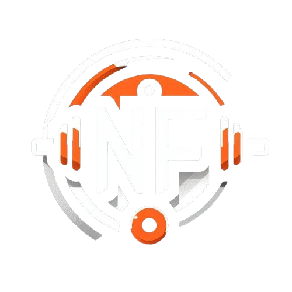

#### Proyecto de 2DAW, Programación y desarrollo de aplicaciones web

**Título del proyecto:** NUTRIFIT 🏋️‍♂️🥗

**Integrantes del grupo:** Jose Aristides, Sergio Castillo, Santiago Galvez.

**Descripción breve:**  
El proyecto consiste en el desarrollo de una plataforma web que actúa como intermediaria entre entrenadores y clientes interesados en recibir asesoramiento personalizado sobre entrenamiento y nutrición. La plataforma permitirá a los clientes explorar perfiles de coaches, comparar sus habilidades y experiencias, y seleccionar al profesional que mejor se adapte a sus necesidades. A su vez, los formadores podrán crear perfiles detallados, mostrar sus especialidades y fijar tarifas por sus servicios.

**Logo:**  

**Estado del proyecto:**  
El proyecto se encuentra en estado de producción. 🚀

**Tecnologías:**  
Las tecnologías utilizadas son: HTML5, CSS3 y JavaScript para el frontend; PHP7 y MySQL para el backend. 💻

**Acceso a web:**  
Para acceder a la página web del proyecto Nutrifit, utilice el siguiente enlace: [Nutrifit](http://nutrifit.com). 🔗

**Uso:**  

La página web consta de varias páginas como: Inicio, Login, Registrarse, Pasarela de pago, Cursos, Panel de control.

**PÁGINA PRINCIPAL:**
La página principal muestra una imagen llamativa que ofrece al usuario conocer el objetivo del proyecto.

En la parte superior de la página se encuentran los botones: Cursos, Entrenadores, Sobre nosotros, Inicio de sesión. Conforme te deslizas hacia abajo en la página principal ves 3 secciones que son entrenamientos, dietas, asesoramiento que te redirigen a la página de cursos.

También tenemos más secciones en la página principal que son: Opiniones, Preguntas frecuentes y contacta con nosotros. 🏠

**PÁGINA LOGIN y PÁGINA REGISTRARSE:**
En la página de login tanto los entrenadores como los clientes deberán logearse y registrarse para poder utilizar la web y todas sus funciones. 🔐

**PÁGINA PANEL DE CONTROL:**
En la página de panel de control se encuentra 4 opciones para ver diferentes páginas que son cursos, perfil, progreso y dietas.

Al deslizar hacia abajo de la página tenemos a los diferentes entrenadores con sus respectivos cursos. 📊

**PÁGINA DE PERFIL:**
En la página de perfil tenemos la información que el cliente ha introducido como su altura, edad, peso... 📋

**PÁGINA DE CV:**
En la página de perfil tenemos la información que el cliente ha introducido como su altura, edad, peso... 📋

**PÁGINA DE CURSOS:**
En la página de cursos tenemos la información que cada entrenador proporciona sobre sus cursos publicados en la web:dietas, entrenamientos y ejercicios.  📋

**Repositorio:** [Nutrifit en GitHub](https://github.com/nutrifitProyecto/Nutrifit.git) 📂
